# Brazilian E-Commerce Analysis 

## OVERVİEW
> The Brazilian E-Commerce Public Dataset by Olist offers an in-depth look into Brazil's vibrant online marketplace, providing insights into the country's e-commerce landscape. This dataset, spanning from 2016 to 2018, captures a wide array of information, from customer orders and seller interactions to detailed product listings. 

> 
> 👉 As a beginner in data analysis, I created this repository to explore and understand the dataset by focusing on four key areas—orders, customers, sellers, and products—using PostgreSQL to perform the analysis.

### 📂 Brazilian-E-Commerce Dataset ERD

> To better understand the relationships between different entities in the dataset, an Entity-Relationship Diagram (ERD) was created.
<p align="center">
  

## 📌 Order Analysis 
### ✅ Question 1 - What is the monthly distribution of orders?

In this query, the monthly distribution of orders was analyzed by grouping them based on their approval date, counting the distinct orders for each month, and sorting the results chronologically.

<details>
<summary>
🧮 Query & Output
</summary>

```sql
SELECT  
    TO_CHAR(DATE_TRUNC('month', order_approved_at), 'YYYY-MM') AS order_month,
    COUNT(DISTINCT order_id) AS order_count
FROM 
    orders
WHERE 
    order_approved_at IS NOT NULL
GROUP BY 
    1
ORDER BY 
    1;
```

#### Output 

| order_month | order_count |
|-------------|-------------|
| 2016-09     | 1           |
| 2016-10     | 320         |
| 2016-12     | 1           |
| 2017-01     | 760         |
| 2017-02     | 1765        |
| 2017-03     | 2689        |
| 2017-04     | 2374        |
| 2017-05     | 3693        |
| 2017-06     | 3252        |
| 2017-07     | 3974        |
| 2017-08     | 4348        |
| 2017-09     | 4301        |
| 2017-10     | 4590        |
| 2017-11     | 7395        |
| 2017-12     | 5832        |
| 2018-01     | 7187        |
| 2018-02     | 6706        |
| 2018-03     | 7288        |
| 2018-04     | 6778        |
| 2018-05     | 7066        |
| 2018-06     | 6164        |
| 2018-07     | 6176        |
| 2018-08     | 6620        |
| 2018-09     | 1           |

</details>

<p align="center">
  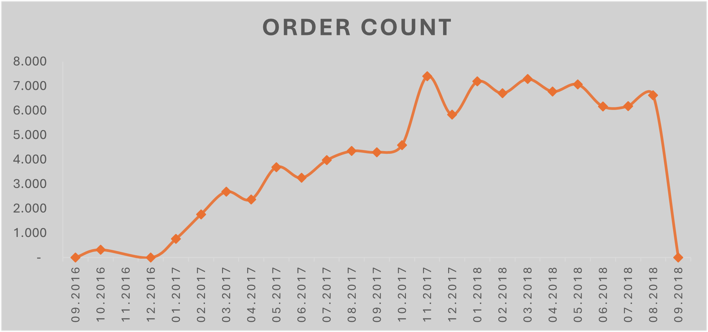

The monthly distribution of orders shows significant variation over the analyzed period. Starting from a minimal count in September 2016, there is a noticeable increase in order volumes from October 2016, peaking in November 2017 with 7,395 orders. After this peak, the order count fluctuates but remains relatively high, with several months recording over 6,000 orders. The dataset ends with a minimal count of 1 order in September 2018, indicating incomplete data for that month. Overall, as shown in the graph below, there is a mostly upward trend in order volume, especially from early to late 2017.

### ✅ Question 2 - How do order counts vary by order status on a monthly basis?

The orders were grouped by month and order status. The process began by truncating the order approval date to the start of the month and formatting it as order_month. Next, the number of orders for each month and status combination was counted. The results were then sorted by both month and order status.

<details>
<summary>
🧮 Query & Output
</summary>

```sql

SELECT 
        DATE_TRUNC('month', order_approved_at)::date AS order_date,
	order_status,
    COUNT(order_id) AS order_count
FROM 
    orders 
	WHERE order_approved_at IS NOT NULL
GROUP BY 
   1,2
ORDER BY 
    1,2;
```

#### Output Example

| order_date  | order_status | order_count |
|-------------|--------------|-------------|
| 2016-09-01  | delivered    | 1           |
| 2016-10-01  | canceled     | 20          |
| 2016-10-01  | delivered    | 265         |
| 2016-10-01  | invoiced     | 18          |
| 2016-10-01  | processing   | 2           |
| 2016-10-01  | shipped      | 9           |
| 2016-10-01  | unavailable  | 6           |

</details>

<p align="center">
  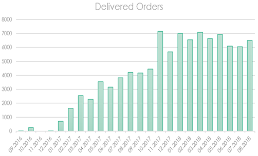

<p align="center">
  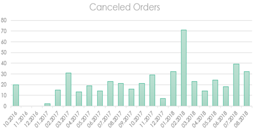
  
Reviewing the output, it appears that order volumes generally increased starting from 2017. However, a dramatic spike is seen in November 2017, which could be attributed to both the Black Friday period and various special occasions celebrated in Brazil during that month. New and repeat customers were likely acquired during this time,  as sales continued to rise following November 2017.  Additionally, the high order volumes observed between January and May 2018 could be related to Brazil's summer and spring seasons.

Regarding canceled orders, the numbers were relatively low in December 2017 and January 2018, but the highest cancellation rate was observed in February 2018. When we examine the charts for 2016, we see that sales were relatively low, while cancellations were relatively high in October. However, due to limited data for that year and the exclusion of null values from the analysis, drawing definitive conclusions about 2016 is challenging.


### ✅ Question 3 - How do order counts vary by days of the week and days of the month?
In these queries, analyses were conducted on order patterns based on days of the week and days of the month.
- For days of the week, the number of orders was counted for each day, grouped by the day, and sorted in descending order of order count.
- For days of the month, the day of the month was extracted, and order counts were grouped and sorted by day in ascending order.

<details>
<summary>
🧮 Query & Output 1 - Days of the Week
</summary>

```sql
SELECT
    CASE EXTRACT(DOW FROM order_purchase_timestamp)
        WHEN 1 THEN 'Monday'
        WHEN 2 THEN 'Tuesday'
        WHEN 3 THEN 'Wednesday'
        WHEN 4 THEN 'Thursday'
        WHEN 5 THEN 'Friday'
        WHEN 6 THEN 'Saturday'
        WHEN 0 THEN 'Sunday'
    END AS days_of_the_week,
    COUNT(order_id) AS order_count
FROM
    orders
GROUP BY
    days_of_the_week
ORDER BY
    order_count DESC;
```
####Output 

| days_of_the_week | order_count |
|------------------|-------------|
| Monday           | 16196       |
| Tuesday          | 15963       |
| Wednesday        | 15552       |
| Thursday         | 14761       |
| Friday           | 14122       |
| Sunday           | 11960       |
| Saturday         | 10887       |


</details>

<p align="center">
  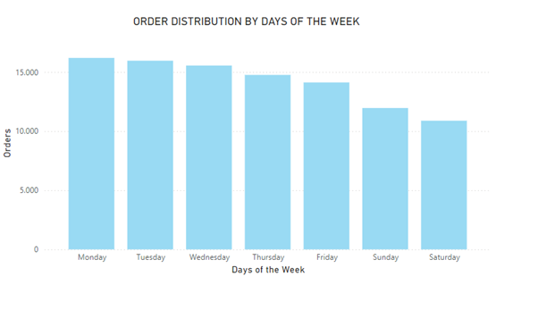

<details>
<summary> 🧮 Query & Output 2 - Days of the Month </summary>

```sql
SELECT
    EXTRACT(DAY FROM order_purchase_timestamp) AS days_of_the_month,
    COUNT(order_id) AS order_count
FROM
    orders
WHERE
    order_purchase_timestamp BETWEEN '2016-01-01' AND '2018-12-31'
GROUP BY
    days_of_the_month
ORDER BY
    days_of_the_month ASC;
```
#### Output 

| days_of_the_month | order_count |
|-------------------|-------------|
| 1                 | 3101        |
| 2                 | 3213        |
| 3                 | 3283        |
| 4                 | 3483        |
| 5                 | 3445        |
| 6                 | 3468        |
| 7                 | 3363        |
| 8                 | 3326        |
| 9                 | 3271        |
| 10                | 3168        |
| 11                | 3308        |
| 12                | 3202        |
| 13                | 3277        |
| 14                | 3387        |
| 15                | 3524        |
| 16                | 3581        |
| 17                | 3200        |
| 18                | 3430        |
| 19                | 3364        |
| 20                | 3261        |
| 21                | 3116        |
| 22                | 3181        |
| 23                | 3128        |
| 24                | 3877        |
| 25                | 3290        |
| 26                | 3290        |
| 27                | 3122        |
| 28                | 3011        |
| 29                | 2557        |
| 30                | 2534        |
| 31                | 1680        |

</details>

<p align="center">
  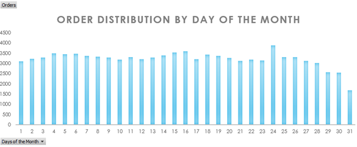
  
When the output is analyzed on a weekly basis, it is observed that the highest sales occur on Mondays, with sales gradually decreasing towards the end of the week. The lowest sales are recorded on Saturdays. The high sales on Mondays might suggest that customers prefer to shop as they start a new week. On Saturdays, customers may choose to rest and spend time with their families, potentially leading to less time for shopping.

On a monthly basis, sales tend to decrease towards the end of the month. This could be due to reduced spending in the final days of the month. On other days, sales remain relatively consistent. Notably, the 24th of the month stands out as the day with the highest sales.

## 📌 Customer Analysis 
### ✅ Question 1 - In which cities do customers shop more?

In this query, the WITH clause was used to create several temporary tables to analyze the total number of orders by city based on each customer's highest order volume:
- Table1: Counts the number of orders for each city by customer.
- Table2: Ranks cities for each customer by order count.
- Table3: Calculates the total orders for each customer.
- Table4: Selects the city with the highest order volume for each customer.
The final result aggregates and sorts the total orders by city in descending order.

<details>
<summary>
🧮 Query & Output 
</summary>

```sql 

  WITH table1 AS(
	SELECT customer_unique_id, 
customer_city, 
COUNT (customer_city) AS order_place
FROM customers
GROUP BY 1,2
), table2 AS (
SELECT customer_unique_id,
customer_city,
order_place,
ROW_NUMBER() OVER (PARTITION BY customer_unique_id ORDER BY order_place DESC) AS rn
FROM table1
	), table3 AS(
		SELECT customer_unique_id,
SUM(order_place) AS total_order
FROM table2 
GROUP BY 1
ORDER BY 1
), table4 AS(
	SELECT t2.customer_unique_id,
customer_city, 
total_order
FROM table2 t2
JOIN table3 t3 ON t2.customer_unique_id= t3.customer_unique_id
WHERE rn=1
) SELECT 
    customer_city,
    SUM(total_order) AS total_orders
FROM 
    table4
GROUP BY 
    customer_city
ORDER BY 
    total_orders DESC;
```
#### Output Example

| customer_city            | total_orders |
|--------------------------|--------------|
| sao paulo                | 15528        |
| rio de janeiro           | 6879         |
| belo horizonte           | 2778         |
| brasilia                 | 2134         |
| curitiba                 | 1521         |
| campinas                 | 1446         |
| porto alegre             | 1379         |
| salvador                 | 1245         |
| guarulhos                | 1188         |
| sao bernardo do campo    | 938          |

</details>

When examining the output, it is seen that the cities with the highest sales are São Paulo and Rio de Janeiro. Considering that these are the most populous cities in Brazil, it can be inferred that a larger number of customers live in these areas. Additionally, due to the fast-paced lifestyle in these major cities, it can be suggested that online shopping is likely a more frequently preferred option.

## 📌 Seller Analysis 
### ✅ Question 1 - Which vendors deliver orders to customers the fastest?

In this query, the average delivery time, total number of orders, and average review score for each seller were analyzed. The WITH clause computed the average delivery time and order count for each seller, focusing on delivered orders, and also calculated the average review score for these sellers. The main query then selected the top 5 sellers with more than 100 orders, sorted by their average delivery time in ascending order, and included their corresponding average review scores.

<details>
<summary>
🧮 Query & Output
</summary>

```sql 
WITH delivery_times AS (
    SELECT
        oi.seller_id,
        ROUND(AVG(EXTRACT(EPOCH FROM o.order_delivered_carrier_date - o.order_approved_at) / 3600)) AS avg_delivery_time,
        COUNT(oi.order_item_id) AS total_orders
    FROM
        orders o
    INNER JOIN
        order_items oi ON o.order_id = oi.order_id
    WHERE
        o.order_status = 'delivered'
    GROUP BY
        oi.seller_id
),
review_scores AS (
    SELECT
        oi.seller_id,
        ROUND(AVG(r.review_score), 2) AS review_score
    FROM
        orders o
    INNER JOIN
        order_items oi ON o.order_id = oi.order_id
    INNER JOIN
        reviews r ON o.order_id = r.order_id
    WHERE
        o.order_status = 'delivered'
    GROUP BY
        oi.seller_id
)
SELECT
    dt.seller_id,
    dt.avg_delivery_time || ' hrs' AS delivery_time,
    dt.total_orders,
    rs.review_score
FROM
    delivery_times dt
LEFT JOIN
    review_scores rs ON dt.seller_id = rs.seller_id
WHERE
    dt.total_orders > 100
ORDER BY
    dt.avg_delivery_time ASC
LIMIT 5;
```
#### Output

| seller_id                            | delivery_time | total_sales | review_scores |
|--------------------------------------|---------------|-------------|---------------|
| 8a432f4e5b471f8da497d7dc517666e2    | 20 hrs        | 106         | 4.20          |
| 9f505651f4a6abe901a56cdc21508025    | 23 hrs        | 426         | 4.31          |
| 850f4f8af5ea87287ac68de36e29107f    | 24 hrs        | 191         | 4.29          |
| 0bae85eb84b9fb3bd773911e89288d54    | 25 hrs        | 145         | 4.23          |
| dbc22125167c298ef99da25668e1011f    | 25 hrs        | 417         | 4.27          |

</details>

<p align="center">
  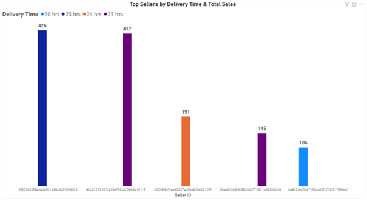

This table shows the average delivery times, total order volumes, and average review scores for the top 5 sellers with more than 100 orders. While all sellers have relatively good review scores and their delivery times are fairly close to each other, It highlights that sellers that handle larger order volumes tend to have slightly longer delivery times.  Notably, the seller with the fastest delivery time of 20 hours has the lowest review score among the top sellers. This suggests that faster delivery does not necessarily lead to better customer satisfaction.

### ✅ Question 2 - Which vendors sell products from more categories?

The diversity of product categories sold by sellers and their total sales volume were analyzed. The order_items, products, and orders tables were joined to calculate the number of distinct product categories sold and the number of completed orders for each seller. The query results in first-rank sellers based on the variety of product categories they offer. Additionally, a secondary ranking was created by sorting sellers by total sales volume.

<details>
<summary>
🧮 Query 
</summary>
  
```sql 
SELECT
    oi.seller_id,
    COUNT(DISTINCT p.product_category_name) AS category_count,
    COUNT(DISTINCT o.order_id) AS total_sales
FROM
    order_items oi
JOIN
    products p ON oi.product_id = p.product_id
JOIN
    orders o ON oi.order_id = o.order_id
GROUP BY
    oi.seller_id
ORDER BY 2 DESC --ORDER BY 3 DESC
LIMIT 10;
```
</details>

#### Table 1 : Order by Category Count 

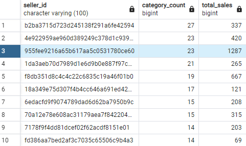

#### Table 2 : Order by Sales

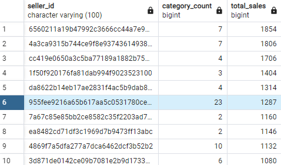

Table 1 ranks sellers by product category diversity, revealing that some sellers offer a broad range of products despite having a relatively low number of total sales. In Table 2, it is observed that most of the top-selling sellers have an average product category variety of more than 2. The sellers with the highest sales generally offer between 3 and 7 different product categories. Notably, the seller ranked 3rd in category diversity and also holds the 5th position in total sales volume. This seller successfully combines a wide product range with high sales volume.

## 📌 Payment Analysis 
### ✅ Question 1 - In which region do users with a high number of installments when making payments live the most? 

This query is used to analyze the regions where customers with a high number of payment installments reside. In the initial step, a temporary table was created using the WITH clause. This table includes data on installment payments by customers, with calculations of average installments along with customer IDs and state information. The WHERE clause filters the data to focus on payments with 6 or more installments. The results rank the number of customers by state based on the number of installments.

<details>
<summary>
🧮 Query & Output
</summary>

```sql
WITH tablo1 AS (
SELECT   c.customer_unique_id, c.customer_state, 
       ROUND(AVG(p.payment_installments),0) AS total_installments
FROM customers c
JOIN orders o ON c.customer_id = o.customer_id
JOIN payments p ON o.order_id = p.order_id
WHERE
payment_installments >= 6
GROUP BY 1,2
ORDER BY 3 DESC
)
SELECT 
    customer_state, 
    total_installments, 
    COUNT(customer_unique_id) AS customer_count
FROM 
    Tablo1
GROUP BY 
    customer_state, total_installments
ORDER BY 
     3 DESC;
```
#### Output Example

| customer_state | total_installments | customer_count |
|----------------|---------------------|----------------|
| SP             | 10                  | 1724           |
| SP             | 8                   | 1517           |
| SP             | 6                   | 1356           |
| RJ             | 10                  | 706            |
| MG             | 10                  | 661            |
| RJ             | 8                   | 578            |
| SP             | 7                   | 550            |
| MG             | 8                   | 518            |
| RJ             | 6                   | 505            |
| MG             | 6                   | 463            |

</details>

<p align="center">
  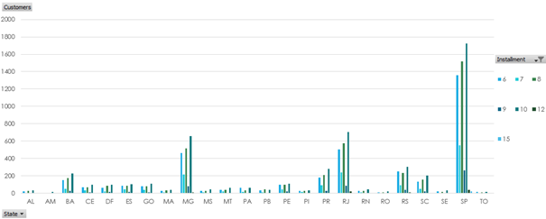

In the output shown above, payments with installment plans of 6 months or more have been considered. Although installment options are available up to 24 months, the number of customers opting for these longer plans is relatively low, with only 1-2 customers per state. Therefore, the chart highlights states with a higher number of customers and installment plans. São Paulo, Rio de Janeiro, and Minas Gerais are the regions where customers tend to use more installment plans. These cities are known for their high population density, and as observed in the case2 output, a significant portion of customers come from these regions. Given the living conditions in these cities, it is likely that customers in these areas prefer to use installment plans more frequently for their purchases.

### ✅ Question 2 - Which categories have the highest use of installment payments?

The queries were designed to make a category-based analysis of orders paid in a single payment versus those paid in installments. The first query analyzes the distribution of orders paid in a single installment across different product categories. The JOIN operations link order, payment, and product data, with a filter applied to include only single-payment transactions. The second query follows the same approach for installment payments. This time, the WHERE clause filters for transactions with more than one installment, and orders are grouped by product category. The results are sorted to identify which product categories are most commonly paid for using installments.

<details> <summary>🧮 Query & Output 1 - Single Payment</summary>

```sql
SELECT pay.payment_installments,
    p.product_category_name,
    COUNT(o.order_id) AS order_count
FROM
    orders o
    JOIN order_items oi ON o.order_id = oi.order_id
    JOIN products p ON oi.product_id = p.product_id
    JOIN payments pay ON o.order_id = pay.order_id
WHERE
    pay.payment_installments = 1
GROUP BY
   1, p.product_category_name
ORDER BY
    3 DESC;
```
#### Output Example

| payment_installments | product_category_name | order_count |
|---------------------|------------------------|-------------|
| 1                   | informatica_acessorios | 5027        |
| 1                   | esporte_lazer          | 4984        |
| 1                   | cama_mesa_banho        | 4690        |
| 1                   | beleza_saude           | 4433        |
| 1                   | moveis_decoracao       | 4241        |
| 1                   | utilidades_domesticas  | 3576        |
| 1                   | telefonia              | 2858        |
| 1                   | ferramentas_jardim     | 2356        |
| 1                   | automotivo             | 2268        |
| 1                   | eletronicos            | 2258        |

</details>

</details> <p align="center"> 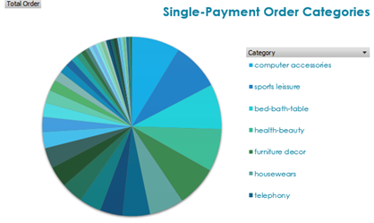 </p>

<details>
<summary> 🧮 Query & Output 2 - Installments </summary>

```sql
SELECT pay.payment_installments,
    p.product_category_name,
    COUNT(o.order_id) AS order_count
FROM
    orders o
    JOIN order_items oi ON o.order_id = oi.order_id
    JOIN products p ON oi.product_id = p.product_id
    JOIN payments pay ON o.order_id = pay.order_id
WHERE
    pay.payment_installments > 1
GROUP BY
    1,2
ORDER BY
    3 DESC;
```

#### Output Example

| payment_installments | product_category_name | order_count |
|---------------------|------------------------|-------------|
| 2                   | beleza_saude           | 1316        |
| 2                   | cama_mesa_banho        | 1236        |
| 3                   | cama_mesa_banho        | 1232        |
| 3                   | beleza_saude           | 1187        |
| 2                   | esporte_lazer          | 1171        |
| 2                   | informatica_acessorios | 1073        |
| 2                   | moveis_decoracao       | 1020        |
| 4                   | cama_mesa_banho        | 1007        |
| 8                   | cama_mesa_banho        | 941         |
| 3                   | esporte_lazer          | 878         |
| 5                   | cama_mesa_banho        | 868         |
| 3                   | moveis_decoracao       | 829         |
| 10                  | cama_mesa_banho        | 818         |

</details>

<p align="center">
  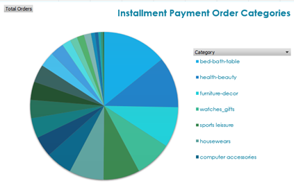

When analyzing the output, it has been observed that the categories with the highest number of both installment and single-payment orders are the same. The payment method for orders in these categories may vary depending on the price. Additionally, these categories also see the highest sales. Categories with installment payments tend to include more housewears and health- beauty, while categories with single payments prominently feature entertainment and technological accessories.

### 👏 Thank You! 

Thank you to everyone who has explored this repository. If you found the project useful or insightful, please consider giving it a star ⭐ to help others discover it more easily.

